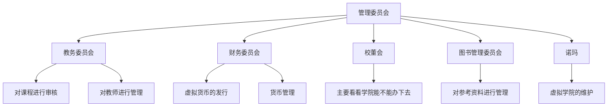
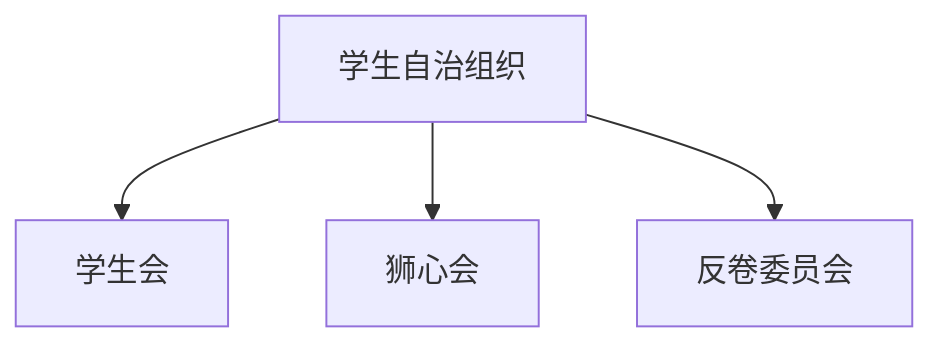

# 卡塞尔学院

## 机构结构

> 说明，不存在管理与被管理的阶级之分

```mermaid
graph TD
A[管理委员会]
C[财务委员会]
C1[虚拟货币的发行]
C2[货币管理]
B[教务委员会]
B1[对课程进行审核]
B2[对教师进行管理]
D[校董会]
D1[主要看看学院能不能办下去]
E[图书管理委员会]
E1[对参考资料进行管理]
F[诺玛]
F1[虚拟学院的维护]
A --> B
B --> B1
B --> B2
C --> C1
C -->C2
A --> C
A --> D
D --> D1 
A --> E
E --> E1
A --> F
F --> F1
```

## 学生自治结构

```mermaid
graph TD
A[学生自治组织]
B[学生会]
C[狮心会]
D[反卷委员会]
A --> B
A --> C
A --> D

```

## 门户网站

* 404页面

* 需要邀请码

## 守夜人论坛

* 单独BBS

## 课程管理

* 申请/批复
* 选课系统

## 专业管理

* 申请/批复

## 教师管理

* 申请/批复

## 选课系统

* 申请/批复

## 考试系统

* 选择题和答案

