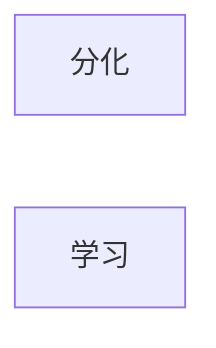

# 文明的历程

* 人类以前
* ...
* 人类文明
* 人类之后

## 聚合

* 宇宙定律：整体看上去，就是聚合在一起的

##  细胞

* 无机物变成有机物？

* ```mermaid
  graph TD
  A[无机物]
  B[有无物]
  C[单细胞]
  D[多细胞]
  E[分化]
  A --> B
  B --> C
  C -.必然.-> D
  D -.效率.-> E
  
  
  
  
  ```

## 多细胞到人类

* 人类是多细胞生物分化出来的一中中间过程产物，应该不是最终产物




## 人类办事流程

  ```mermaid
  graph LR
  A[困难事情]
  A1[工程化]
  A11[项目1]
  A12[项目2]
  A13[项目3]
  A14[项目4]
  
  A --> A1
  A1 --> A11
  A1 --> A12
  A1 --> A13
  A1 --> A14
  B[人类]
  B1[聚集化]
  B11[专业化1]
  B12[专业化2]
  B13[专业化3]
  B14[专业化4]
  
  A11 --> B11
  A12 --> B12
  A13 --> B13
  A14 --> B14
  B11 --> B1
  B12 --> B1
  B13 --> B1
  B14 --> B1
  B1 --> B
  ```

  

