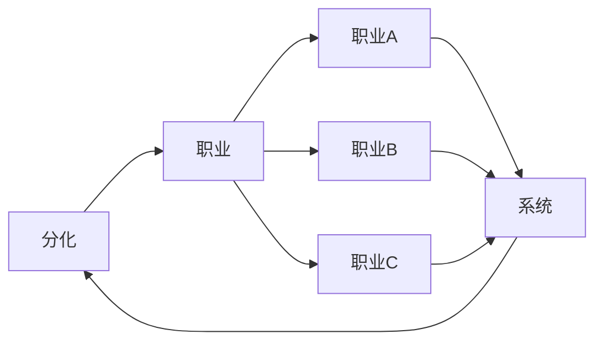

# 人类到社会

## 人类会聚集在一起

## 武力才是长久的话语权

* 但其本质是：谁能击中水的弱点

## 武力对权利的影响

* 人性

## 分化

* 职业

## 公有变私有

* 人类发现一个人吃俩食物的好处时！
* 私有 驱动人类发展

## 分化与系统相辅相成

```mermaid
graph LR
A[分化] --> B[职业]
B[职业] --> B1[职业A]
B[职业] --> B2[职业B]
B[职业] --> B3[职业C]
B1 --> S[系统]
B2 --> S
B3 --> S
S --> A


```

## 你改不改？

