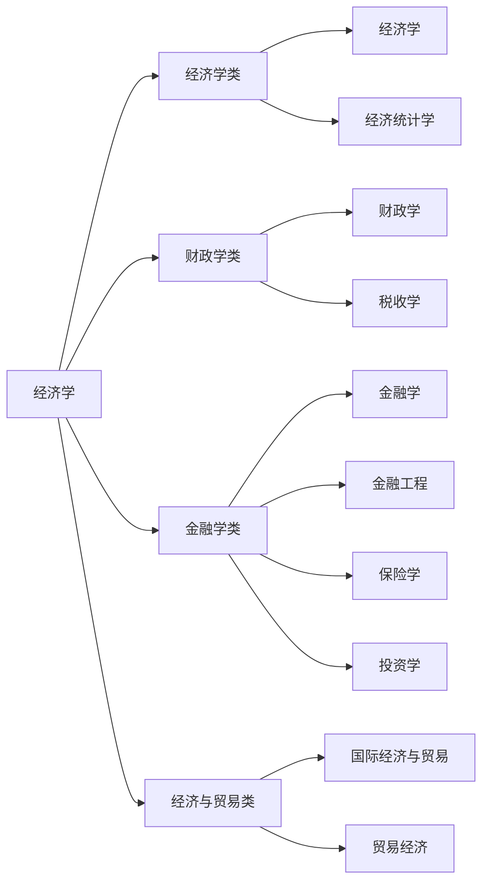

```mermaid
graph LR
    Node02[经济学]
    Node0201[经济学类]
    Node020101[经济学]
    Node020102[经济统计学]
    Node0202[财政学类]
    Node020201K[财政学]
    Node020202[税收学]
    Node0203[金融学类]
    Node020301K[金融学]
    Node020302[金融工程]
    Node020303[保险学]
    Node020304[投资学]
    Node0204[经济与贸易类]
    Node020401[国际经济与贸易]
    Node020402[贸易经济]
    Node02 --> Node0201
    Node0201 --> Node020101
    Node0201 --> Node020102
    Node02 --> Node0202
    Node0202 --> Node020201K
    Node0202 --> Node020202
    Node02 --> Node0203
    Node0203 --> Node020301K
    Node0203 --> Node020302
    Node0203 --> Node020303
    Node0203 --> Node020304
    Node02 --> Node0204
    Node0204 --> Node020401
    Node0204 --> Node020402
```
