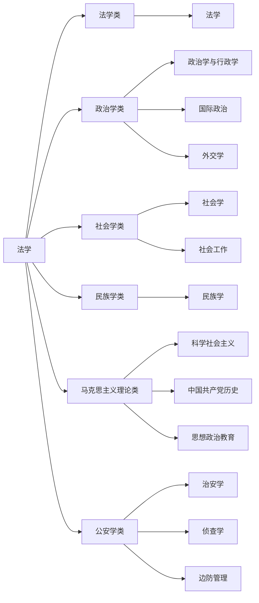

```mermaid
graph LR
    Node03[法学]
    Node0301[法学类]
    Node030101K[法学]
    Node0302[政治学类]
    Node030201[政治学与行政学]
    Node030202[国际政治]
    Node030203[外交学]
    Node0303[社会学类]
    Node030301[社会学]
    Node030302[社会工作]
    Node0304[民族学类]
    Node030401[民族学]
    Node0305[马克思主义理论类]
    Node030501[科学社会主义]
    Node030502[中国共产党历史]
    Node030503[思想政治教育]
    Node0306[公安学类]
    Node030601K[治安学]
    Node030602K[侦查学]
    Node030603K[边防管理]
    Node03 --> Node0301
    Node0301 --> Node030101K
    Node03 --> Node0302
    Node0302 --> Node030201
    Node0302 --> Node030202
    Node0302 --> Node030203
    Node03 --> Node0303
    Node0303 --> Node030301
    Node0303 --> Node030302
    Node03 --> Node0304
    Node0304 --> Node030401
    Node03 --> Node0305
    Node0305 --> Node030501
    Node0305 --> Node030502
    Node0305 --> Node030503
    Node03 --> Node0306
    Node0306 --> Node030601K
    Node0306 --> Node030602K
    Node0306 --> Node030603K
```
