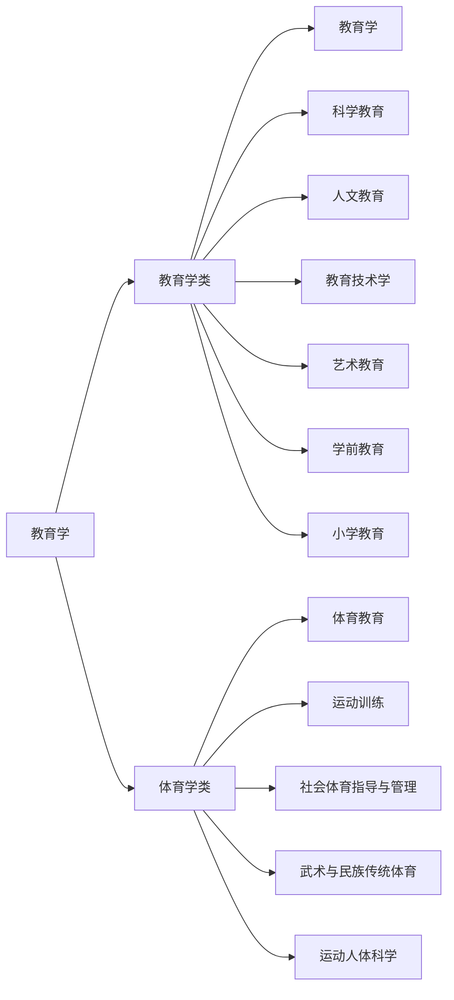

```mermaid
graph LR
    Node04[教育学]
    Node0401[教育学类]
    Node040101[教育学]
    Node040102[科学教育]
    Node040103[人文教育]
    Node040104[教育技术学]
    Node040105[艺术教育]
    Node040106[学前教育]
    Node040107[小学教育]
    Node0402[体育学类]
    Node040201[体育教育]
    Node040202K[运动训练]
    Node040203[社会体育指导与管理]
    Node040204K[武术与民族传统体育]
    Node040205[运动人体科学]
    Node04 --> Node0401
    Node0401 --> Node040101
    Node0401 --> Node040102
    Node0401 --> Node040103
    Node0401 --> Node040104
    Node0401 --> Node040105
    Node0401 --> Node040106
    Node0401 --> Node040107
    Node04 --> Node0402
    Node0402 --> Node040201
    Node0402 --> Node040202K
    Node0402 --> Node040203
    Node0402 --> Node040204K
    Node0402 --> Node040205
```
