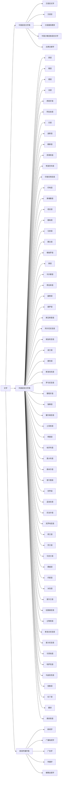

```mermaid
graph LR
    Node05[文学]
    Node0501[中国语言文学类]
    Node050101[汉语言文学]
    Node050102[汉语言]
    Node050103[汉语国际教育]
    Node050104[中国少数民族语言文学]
    Node050105[古典文献学]
    Node0502[外国语言文学类]
    Node050201[英语]
    Node050202[俄语]
    Node050203[德语]
    Node050204[法语]
    Node050205[西班牙语]
    Node050206[阿拉伯语]
    Node050207[日语]
    Node050208[波斯语]
    Node050209[朝鲜语]
    Node050210[菲律宾语]
    Node050211[梵语巴利语]
    Node050212[印度尼西亚语]
    Node050213[印地语]
    Node050214[柬埔寨语]
    Node050215[老挝语]
    Node050216[缅甸语]
    Node050217[马来语]
    Node050218[蒙古语]
    Node050219[僧伽罗语]
    Node050220[泰语]
    Node050221[乌尔都语]
    Node050222[希伯来语]
    Node050223[越南语]
    Node050224[豪萨语]
    Node050225[斯瓦希里语]
    Node050226[阿尔巴尼亚语]
    Node050227[保加利亚语]
    Node050228[波兰语]
    Node050229[捷克语]
    Node050230[斯洛伐克语]
    Node050231[罗马尼亚语]
    Node050232[葡萄牙语]
    Node050233[瑞典语]
    Node050234[塞尔维亚语]
    Node050235[土耳其语]
    Node050236[希腊语]
    Node050237[匈牙利语]
    Node050238[意大利语]
    Node050239[泰米尔语]
    Node050240[普什图语]
    Node050241[世界语]
    Node050242[孟加拉语]
    Node050243[尼泊尔语]
    Node050244[克罗地亚语]
    Node050245[荷兰语]
    Node050246[芬兰语]
    Node050247[乌克兰语]
    Node050248[挪威语]
    Node050249[丹麦语]
    Node050250[冰岛语]
    Node050251[爱尔兰语]
    Node050252[拉脱维亚语]
    Node050253[立陶宛语]
    Node050254[斯洛文尼亚语]
    Node050255[爱沙尼亚语]
    Node050256[马耳他语]
    Node050257[哈萨克语]
    Node050258[乌兹别克语]
    Node050259[祖鲁语]
    Node050260[拉丁语]
    Node050261[翻译]
    Node050262[商务英语]
    Node0503[新闻传播学类]
    Node050301[新闻学]
    Node050302[广播电视学]
    Node050303[广告学]
    Node050304[传播学]
    Node050305[编辑出版学]
    Node05 --> Node0501
    Node0501 --> Node050101
    Node0501 --> Node050102
    Node0501 --> Node050103
    Node0501 --> Node050104
    Node0501 --> Node050105
    Node05 --> Node0502
    Node0502 --> Node050201
    Node0502 --> Node050202
    Node0502 --> Node050203
    Node0502 --> Node050204
    Node0502 --> Node050205
    Node0502 --> Node050206
    Node0502 --> Node050207
    Node0502 --> Node050208
    Node0502 --> Node050209
    Node0502 --> Node050210
    Node0502 --> Node050211
    Node0502 --> Node050212
    Node0502 --> Node050213
    Node0502 --> Node050214
    Node0502 --> Node050215
    Node0502 --> Node050216
    Node0502 --> Node050217
    Node0502 --> Node050218
    Node0502 --> Node050219
    Node0502 --> Node050220
    Node0502 --> Node050221
    Node0502 --> Node050222
    Node0502 --> Node050223
    Node0502 --> Node050224
    Node0502 --> Node050225
    Node0502 --> Node050226
    Node0502 --> Node050227
    Node0502 --> Node050228
    Node0502 --> Node050229
    Node0502 --> Node050230
    Node0502 --> Node050231
    Node0502 --> Node050232
    Node0502 --> Node050233
    Node0502 --> Node050234
    Node0502 --> Node050235
    Node0502 --> Node050236
    Node0502 --> Node050237
    Node0502 --> Node050238
    Node0502 --> Node050239
    Node0502 --> Node050240
    Node0502 --> Node050241
    Node0502 --> Node050242
    Node0502 --> Node050243
    Node0502 --> Node050244
    Node0502 --> Node050245
    Node0502 --> Node050246
    Node0502 --> Node050247
    Node0502 --> Node050248
    Node0502 --> Node050249
    Node0502 --> Node050250
    Node0502 --> Node050251
    Node0502 --> Node050252
    Node0502 --> Node050253
    Node0502 --> Node050254
    Node0502 --> Node050255
    Node0502 --> Node050256
    Node0502 --> Node050257
    Node0502 --> Node050258
    Node0502 --> Node050259
    Node0502 --> Node050260
    Node0502 --> Node050261
    Node0502 --> Node050262
    Node05 --> Node0503
    Node0503 --> Node050301
    Node0503 --> Node050302
    Node0503 --> Node050303
    Node0503 --> Node050304
    Node0503 --> Node050305
```
