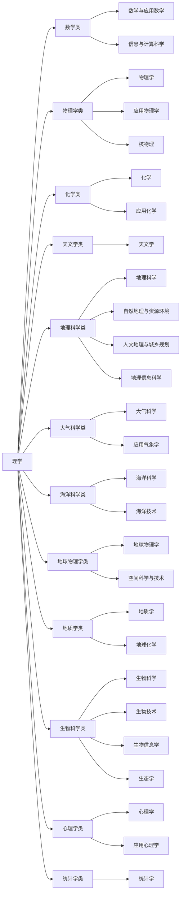

```mermaid
graph LR
    Node07[理学]
    Node0701[数学类]
    Node070101[数学与应用数学]
    Node070102[信息与计算科学]
    Node0702[物理学类]
    Node070201[物理学]
    Node070202[应用物理学]
    Node070203[核物理]
    Node0703[化学类]
    Node070301[化学]
    Node070302[应用化学]
    Node0704[天文学类]
    Node070401[天文学]
    Node0705[地理科学类]
    Node070501[地理科学]
    Node070502[自然地理与资源环境]
    Node070503[人文地理与城乡规划]
    Node070504[地理信息科学]
    Node0706[大气科学类]
    Node070601[大气科学]
    Node070602[应用气象学]
    Node0707[海洋科学类]
    Node070701[海洋科学]
    Node070702[海洋技术]
    Node0708[地球物理学类]
    Node070801[地球物理学]
    Node070802[空间科学与技术]
    Node0709[地质学类]
    Node070901[地质学]
    Node070902[地球化学]
    Node0710[生物科学类]
    Node071001[生物科学]
    Node071002[生物技术]
    Node071003[生物信息学]
    Node071004[生态学]
    Node0711[心理学类]
    Node071101[心理学]
    Node071102[应用心理学]
    Node0712[统计学类]
    Node071201[统计学]
    Node07 --> Node0701
    Node0701 --> Node070101
    Node0701 --> Node070102
    Node07 --> Node0702
    Node0702 --> Node070201
    Node0702 --> Node070202
    Node0702 --> Node070203
    Node07 --> Node0703
    Node0703 --> Node070301
    Node0703 --> Node070302
    Node07 --> Node0704
    Node0704 --> Node070401
    Node07 --> Node0705
    Node0705 --> Node070501
    Node0705 --> Node070502
    Node0705 --> Node070503
    Node0705 --> Node070504
    Node07 --> Node0706
    Node0706 --> Node070601
    Node0706 --> Node070602
    Node07 --> Node0707
    Node0707 --> Node070701
    Node0707 --> Node070702
    Node07 --> Node0708
    Node0708 --> Node070801
    Node0708 --> Node070802
    Node07 --> Node0709
    Node0709 --> Node070901
    Node0709 --> Node070902
    Node07 --> Node0710
    Node0710 --> Node071001
    Node0710 --> Node071002
    Node0710 --> Node071003
    Node0710 --> Node071004
    Node07 --> Node0711
    Node0711 --> Node071101
    Node0711 --> Node071102
    Node07 --> Node0712
    Node0712 --> Node071201
```
