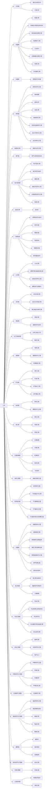

```mermaid
graph LR
    Node08[工学]
    Node0801[力学类]
    Node080101[理论与应用力学]
    Node080102[工程力学]
    Node0802[机械类]
    Node080201[机械工程]
    Node080202[机械设计制造及其自动化]
    Node080203[材料成型及控制工程]
    Node080204[机械电子工程]
    Node080205[工业设计]
    Node080206[过程装备与控制工程]
    Node080207[车辆工程]
    Node080208[汽车服务工程]
    Node0803[仪器类]
    Node080301[测控技术与仪器]
    Node0804[材料类]
    Node080401[材料科学与工程]
    Node080402[材料物理]
    Node080403[材料化学]
    Node080404[冶金工程]
    Node080405[金属材料工程]
    Node080406[无机非金属材料工程]
    Node080407[高分子材料与工程]
    Node080408[复合材料与工程]
    Node0805[能源动力类]
    Node080501[能源与动力工程]
    Node0806[电气类]
    Node080601[电气工程及其自动化]
    Node0807[电子信息类]
    Node080701[电子信息工程]
    Node080702[电子科学与技术]
    Node080703[通信工程]
    Node080704[微电子科学与工程]
    Node080705[光电信息科学与工程]
    Node080706[信息工程]
    Node0808[自动化类]
    Node080801[自动化]
    Node0809[计算机类]
    Node080901[计算机科学与技术]
    Node080902[软件工程]
    Node080903[网络工程]
    Node080904K[信息安全]
    Node080905[物联网工程]
    Node080906[数字媒体技术]
    Node0810[土木类]
    Node081001[土木工程]
    Node081002[建筑环境与能源应用工程]
    Node081003[给排水科学与工程]
    Node081004[建筑电气与智能化]
    Node0811[水利类]
    Node081101[水利水电工程]
    Node081102[水文与水资源工程]
    Node081103[港口航道与海岸工程]
    Node0812[测绘类]
    Node081201[测绘工程]
    Node081202[遥感科学与技术]
    Node0813[化工与制药类]
    Node081301[化学工程与工艺]
    Node081302[制药工程]
    Node0814[地质类]
    Node081401[地质工程]
    Node081402[勘查技术与工程]
    Node081403[资源勘查工程]
    Node0815[矿业类]
    Node081501[采矿工程]
    Node081502[石油工程]
    Node081503[矿物加工工程]
    Node081504[油气储运工程]
    Node0816[纺织类]
    Node081601[纺织工程]
    Node081602[服装设计与工程]
    Node0817[轻工类]
    Node081701[轻化工程]
    Node081702[包装工程]
    Node081703[印刷工程]
    Node0818[交通运输类]
    Node081801[交通运输]
    Node081802[交通工程]
    Node081803K[航海技术]
    Node081804K[轮机工程]
    Node081805K[飞行技术]
    Node0819[海洋工程类]
    Node081901[船舶与海洋工程]
    Node0820[航空航天类]
    Node082001[航空航天工程]
    Node082002[飞行器设计与工程]
    Node082003[飞行器制造工程]
    Node082004[飞行器动力工程]
    Node082005[飞行器环境与生命保障工程]
    Node0821[兵器类]
    Node082101[武器系统与工程]
    Node082102[武器发射工程]
    Node082103[探测制导与控制技术]
    Node082104[弹药工程与爆炸技术]
    Node082105[特种能源技术与工程]
    Node082106[装甲车辆工程]
    Node082107[信息对抗技术]
    Node0822[核工程类]
    Node082201[核工程与核技术]
    Node082202[辐射防护与核安全]
    Node082203[工程物理]
    Node0823[农业工程类]
    Node082301[农业工程]
    Node082302[农业机械化及其自动化]
    Node082303[农业电气化]
    Node082304[农业建筑环境与能源工程]
    Node082305[农业水利工程]
    Node0824[林业工程类]
    Node082401[森林工程]
    Node082402[木材科学与工程]
    Node082403[林产化工]
    Node0825[环境科学与工程类]
    Node082501[环境科学与工程]
    Node082502[环境工程]
    Node082503[环境科学]
    Node082504[环境生态工程]
    Node0826[生物医学工程类]
    Node082601[生物医学工程]
    Node0827[食品科学与工程类]
    Node082701[食品科学与工程]
    Node082702[食品质量与安全]
    Node082703[粮食工程]
    Node082704[乳品工程]
    Node082705[酿酒工程]
    Node0828[建筑类]
    Node082801[建筑学]
    Node082802[城乡规划]
    Node082803[风景园林]
    Node0829[安全科学与工程类]
    Node082901[安全工程]
    Node0830[生物工程类]
    Node083001[生物工程]
    Node0831[公安技术类]
    Node083101K[刑事科学技术]
    Node083102K[消防工程]
    Node08 --> Node0801
    Node0801 --> Node080101
    Node0801 --> Node080102
    Node08 --> Node0802
    Node0802 --> Node080201
    Node0802 --> Node080202
    Node0802 --> Node080203
    Node0802 --> Node080204
    Node0802 --> Node080205
    Node0802 --> Node080206
    Node0802 --> Node080207
    Node0802 --> Node080208
    Node08 --> Node0803
    Node0803 --> Node080301
    Node08 --> Node0804
    Node0804 --> Node080401
    Node0804 --> Node080402
    Node0804 --> Node080403
    Node0804 --> Node080404
    Node0804 --> Node080405
    Node0804 --> Node080406
    Node0804 --> Node080407
    Node0804 --> Node080408
    Node08 --> Node0805
    Node0805 --> Node080501
    Node08 --> Node0806
    Node0806 --> Node080601
    Node08 --> Node0807
    Node0807 --> Node080701
    Node0807 --> Node080702
    Node0807 --> Node080703
    Node0807 --> Node080704
    Node0807 --> Node080705
    Node0807 --> Node080706
    Node08 --> Node0808
    Node0808 --> Node080801
    Node08 --> Node0809
    Node0809 --> Node080901
    Node0809 --> Node080902
    Node0809 --> Node080903
    Node0809 --> Node080904K
    Node0809 --> Node080905
    Node0809 --> Node080906
    Node08 --> Node0810
    Node0810 --> Node081001
    Node0810 --> Node081002
    Node0810 --> Node081003
    Node0810 --> Node081004
    Node08 --> Node0811
    Node0811 --> Node081101
    Node0811 --> Node081102
    Node0811 --> Node081103
    Node08 --> Node0812
    Node0812 --> Node081201
    Node0812 --> Node081202
    Node08 --> Node0813
    Node0813 --> Node081301
    Node0813 --> Node081302
    Node08 --> Node0814
    Node0814 --> Node081401
    Node0814 --> Node081402
    Node0814 --> Node081403
    Node08 --> Node0815
    Node0815 --> Node081501
    Node0815 --> Node081502
    Node0815 --> Node081503
    Node0815 --> Node081504
    Node08 --> Node0816
    Node0816 --> Node081601
    Node0816 --> Node081602
    Node08 --> Node0817
    Node0817 --> Node081701
    Node0817 --> Node081702
    Node0817 --> Node081703
    Node08 --> Node0818
    Node0818 --> Node081801
    Node0818 --> Node081802
    Node0818 --> Node081803K
    Node0818 --> Node081804K
    Node0818 --> Node081805K
    Node08 --> Node0819
    Node0819 --> Node081901
    Node08 --> Node0820
    Node0820 --> Node082001
    Node0820 --> Node082002
    Node0820 --> Node082003
    Node0820 --> Node082004
    Node0820 --> Node082005
    Node08 --> Node0821
    Node0821 --> Node082101
    Node0821 --> Node082102
    Node0821 --> Node082103
    Node0821 --> Node082104
    Node0821 --> Node082105
    Node0821 --> Node082106
    Node0821 --> Node082107
    Node08 --> Node0822
    Node0822 --> Node082201
    Node0822 --> Node082202
    Node0822 --> Node082203
    Node08 --> Node0823
    Node0823 --> Node082301
    Node0823 --> Node082302
    Node0823 --> Node082303
    Node0823 --> Node082304
    Node0823 --> Node082305
    Node08 --> Node0824
    Node0824 --> Node082401
    Node0824 --> Node082402
    Node0824 --> Node082403
    Node08 --> Node0825
    Node0825 --> Node082501
    Node0825 --> Node082502
    Node0825 --> Node082503
    Node0825 --> Node082504
    Node08 --> Node0826
    Node0826 --> Node082601
    Node08 --> Node0827
    Node0827 --> Node082701
    Node0827 --> Node082702
    Node0827 --> Node082703
    Node0827 --> Node082704
    Node0827 --> Node082705
    Node08 --> Node0828
    Node0828 --> Node082801
    Node0828 --> Node082802
    Node0828 --> Node082803
    Node08 --> Node0829
    Node0829 --> Node082901
    Node08 --> Node0830
    Node0830 --> Node083001
    Node08 --> Node0831
    Node0831 --> Node083101K
    Node0831 --> Node083102K
```
