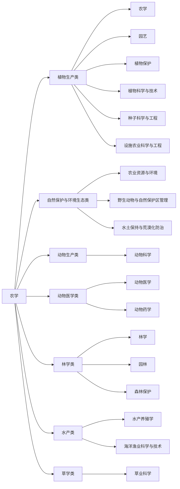

```mermaid
graph LR
    Node09[农学]
    Node0901[植物生产类]
    Node090101[农学]
    Node090102[园艺]
    Node090103[植物保护]
    Node090104[植物科学与技术]
    Node090105[种子科学与工程]
    Node090106[设施农业科学与工程]
    Node0902[自然保护与环境生态类]
    Node090201[农业资源与环境]
    Node090202[野生动物与自然保护区管理]
    Node090203[水土保持与荒漠化防治]
    Node0903[动物生产类]
    Node090301[动物科学]
    Node0904[动物医学类]
    Node090401[动物医学]
    Node090402[动物药学]
    Node0905[林学类]
    Node090501[林学]
    Node090502[园林]
    Node090503[森林保护]
    Node0906[水产类]
    Node090601[水产养殖学]
    Node090602[海洋渔业科学与技术]
    Node0907[草学类]
    Node090701[草业科学]
    Node09 --> Node0901
    Node0901 --> Node090101
    Node0901 --> Node090102
    Node0901 --> Node090103
    Node0901 --> Node090104
    Node0901 --> Node090105
    Node0901 --> Node090106
    Node09 --> Node0902
    Node0902 --> Node090201
    Node0902 --> Node090202
    Node0902 --> Node090203
    Node09 --> Node0903
    Node0903 --> Node090301
    Node09 --> Node0904
    Node0904 --> Node090401
    Node0904 --> Node090402
    Node09 --> Node0905
    Node0905 --> Node090501
    Node0905 --> Node090502
    Node0905 --> Node090503
    Node09 --> Node0906
    Node0906 --> Node090601
    Node0906 --> Node090602
    Node09 --> Node0907
    Node0907 --> Node090701
```
