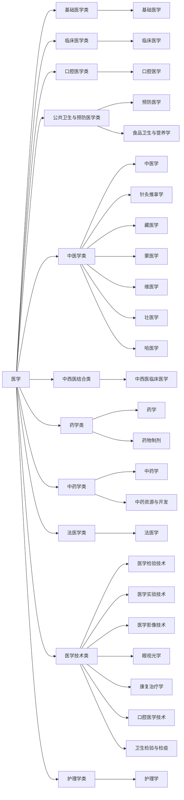

```mermaid
graph LR
    Node10[医学]
    Node1001[基础医学类]
    Node100101K[基础医学]
    Node1002[临床医学类]
    Node100201K[临床医学]
    Node1003[口腔医学类]
    Node100301K[口腔医学]
    Node1004[公共卫生与预防医学类]
    Node100401K[预防医学]
    Node100402[食品卫生与营养学]
    Node1005[中医学类]
    Node100501K[中医学]
    Node100502K[针灸推拿学]
    Node100503K[藏医学]
    Node100504K[蒙医学]
    Node100505K[维医学]
    Node100506K[壮医学]
    Node100507K[哈医学]
    Node1006[中西医结合类]
    Node100601K[中西医临床医学]
    Node1007[药学类]
    Node100701[药学]
    Node100702[药物制剂]
    Node1008[中药学类]
    Node100801[中药学]
    Node100802[中药资源与开发]
    Node1009[法医学类]
    Node100901K[法医学]
    Node1010[医学技术类]
    Node101001[医学检验技术]
    Node101002[医学实验技术]
    Node101003[医学影像技术]
    Node101004[眼视光学]
    Node101005[康复治疗学]
    Node101006[口腔医学技术]
    Node101007[卫生检验与检疫]
    Node1011[护理学类]
    Node101101[护理学]
    Node10 --> Node1001
    Node1001 --> Node100101K
    Node10 --> Node1002
    Node1002 --> Node100201K
    Node10 --> Node1003
    Node1003 --> Node100301K
    Node10 --> Node1004
    Node1004 --> Node100401K
    Node1004 --> Node100402
    Node10 --> Node1005
    Node1005 --> Node100501K
    Node1005 --> Node100502K
    Node1005 --> Node100503K
    Node1005 --> Node100504K
    Node1005 --> Node100505K
    Node1005 --> Node100506K
    Node1005 --> Node100507K
    Node10 --> Node1006
    Node1006 --> Node100601K
    Node10 --> Node1007
    Node1007 --> Node100701
    Node1007 --> Node100702
    Node10 --> Node1008
    Node1008 --> Node100801
    Node1008 --> Node100802
    Node10 --> Node1009
    Node1009 --> Node100901K
    Node10 --> Node1010
    Node1010 --> Node101001
    Node1010 --> Node101002
    Node1010 --> Node101003
    Node1010 --> Node101004
    Node1010 --> Node101005
    Node1010 --> Node101006
    Node1010 --> Node101007
    Node10 --> Node1011
    Node1011 --> Node101101
```
