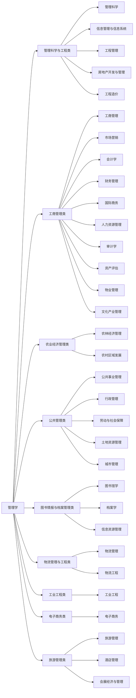

```mermaid
graph LR
    Node12[管理学]
    Node1201[管理科学与工程类]
    Node120101[管理科学]
    Node120102[信息管理与信息系统]
    Node120103[工程管理]
    Node120104[房地产开发与管理]
    Node120105[工程造价]
    Node1202[工商管理类]
    Node120201K[工商管理]
    Node120202[市场营销]
    Node120203K[会计学]
    Node120204[财务管理]
    Node120205[国际商务]
    Node120206[人力资源管理]
    Node120207[审计学]
    Node120208[资产评估]
    Node120209[物业管理]
    Node120210[文化产业管理]
    Node1203[农业经济管理类]
    Node120301[农林经济管理]
    Node120302[农村区域发展]
    Node1204[公共管理类]
    Node120401[公共事业管理]
    Node120402[行政管理]
    Node120403[劳动与社会保障]
    Node120404[土地资源管理]
    Node120405[城市管理]
    Node1205[图书情报与档案管理类]
    Node120501[图书馆学]
    Node120502[档案学]
    Node120503[信息资源管理]
    Node1206[物流管理与工程类]
    Node120601[物流管理]
    Node120602[物流工程]
    Node1207[工业工程类]
    Node120701[工业工程]
    Node1208[电子商务类]
    Node120801[电子商务]
    Node1209[旅游管理类]
    Node120901K[旅游管理]
    Node120902[酒店管理]
    Node120903[会展经济与管理]
    Node12 --> Node1201
    Node1201 --> Node120101
    Node1201 --> Node120102
    Node1201 --> Node120103
    Node1201 --> Node120104
    Node1201 --> Node120105
    Node12 --> Node1202
    Node1202 --> Node120201K
    Node1202 --> Node120202
    Node1202 --> Node120203K
    Node1202 --> Node120204
    Node1202 --> Node120205
    Node1202 --> Node120206
    Node1202 --> Node120207
    Node1202 --> Node120208
    Node1202 --> Node120209
    Node1202 --> Node120210
    Node12 --> Node1203
    Node1203 --> Node120301
    Node1203 --> Node120302
    Node12 --> Node1204
    Node1204 --> Node120401
    Node1204 --> Node120402
    Node1204 --> Node120403
    Node1204 --> Node120404
    Node1204 --> Node120405
    Node12 --> Node1205
    Node1205 --> Node120501
    Node1205 --> Node120502
    Node1205 --> Node120503
    Node12 --> Node1206
    Node1206 --> Node120601
    Node1206 --> Node120602
    Node12 --> Node1207
    Node1207 --> Node120701
    Node12 --> Node1208
    Node1208 --> Node120801
    Node12 --> Node1209
    Node1209 --> Node120901K
    Node1209 --> Node120902
    Node1209 --> Node120903
```
