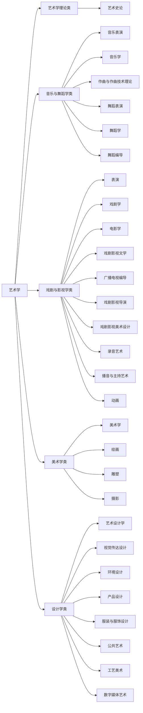

```mermaid
graph LR
    Node13[艺术学]
    Node1301[艺术学理论类]
    Node130101[艺术史论]
    Node1302[音乐与舞蹈学类]
    Node130201[音乐表演]
    Node130202[音乐学]
    Node130203[作曲与作曲技术理论]
    Node130204[舞蹈表演]
    Node130205[舞蹈学]
    Node130206[舞蹈编导]
    Node1303[戏剧与影视学类]
    Node130301[表演]
    Node130302[戏剧学]
    Node130303[电影学]
    Node130304[戏剧影视文学]
    Node130305[广播电视编导]
    Node130306[戏剧影视导演]
    Node130307[戏剧影视美术设计]
    Node130308[录音艺术]
    Node130309[播音与主持艺术]
    Node130310[动画]
    Node1304[美术学类]
    Node130401[美术学]
    Node130402[绘画]
    Node130403[雕塑]
    Node130404[摄影]
    Node1305[设计学类]
    Node130501[艺术设计学]
    Node130502[视觉传达设计]
    Node130503[环境设计]
    Node130504[产品设计]
    Node130505[服装与服饰设计]
    Node130506[公共艺术]
    Node130507[工艺美术]
    Node130508[数字媒体艺术]
    Node13 --> Node1301
    Node1301 --> Node130101
    Node13 --> Node1302
    Node1302 --> Node130201
    Node1302 --> Node130202
    Node1302 --> Node130203
    Node1302 --> Node130204
    Node1302 --> Node130205
    Node1302 --> Node130206
    Node13 --> Node1303
    Node1303 --> Node130301
    Node1303 --> Node130302
    Node1303 --> Node130303
    Node1303 --> Node130304
    Node1303 --> Node130305
    Node1303 --> Node130306
    Node1303 --> Node130307
    Node1303 --> Node130308
    Node1303 --> Node130309
    Node1303 --> Node130310
    Node13 --> Node1304
    Node1304 --> Node130401
    Node1304 --> Node130402
    Node1304 --> Node130403
    Node1304 --> Node130404
    Node13 --> Node1305
    Node1305 --> Node130501
    Node1305 --> Node130502
    Node1305 --> Node130503
    Node1305 --> Node130504
    Node1305 --> Node130505
    Node1305 --> Node130506
    Node1305 --> Node130507
    Node1305 --> Node130508
```
