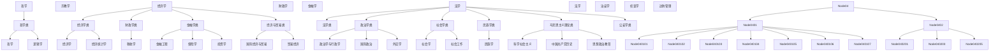

```mermaid
graph TB
Node01[哲学]
Node0101[哲学类]
Node010101[哲学]
Node010102[逻辑学]
Node010103K[宗教学]
Node02[经济学]
Node0201[经济学类]
Node020101[经济学]
Node020102[经济统计学]
Node0202[财政学类]
Node020201K[财政学]
Node020202[税收学]
Node0203[金融学类]
Node020301K[金融学]
Node020302[金融工程]
Node020303[保险学]
Node020304[投资学]
Node0204[经济与贸易类]
Node020401[国际经济与贸易]
Node020402[贸易经济]
Node03[法学]
Node0301[法学类]
Node030101K[法学]
Node0302[政治学类]
Node030201[政治学与行政学]
Node030202[国际政治]
Node030203[外交学]
Node0303[社会学类]
Node030301[社会学]
Node030302[社会工作]
Node0304[民族学类]
Node030401[民族学]
Node0305[马克思主义理论类]
Node030501[科学社会主义]
Node030502[中国共产党历史]
Node030503[思想政治教育]
Node0306[公安学类]
Node030601K[治安学]
Node030602K[侦查学]
Node030603K[边防管理]
Node01 --> Node0101
Node0101 --> Node010101
Node0101 --> Node010102
Node02 --> Node0201
Node0201 --> Node020101
Node0201 --> Node020102
Node02 --> Node0202
Node0202 --> Node020202
Node02 --> Node0203
Node0203 --> Node020302
Node0203 --> Node020303
Node0203 --> Node020304
Node02 --> Node0204
Node0204 --> Node020401
Node0204 --> Node020402
Node03 --> Node0301
Node03 --> Node0302
Node0302 --> Node030201
Node0302 --> Node030202
Node0302 --> Node030203
Node03 --> Node0303
Node0303 --> Node030301
Node0303 --> Node030302
Node03 --> Node0304
Node0304 --> Node030401
Node03 --> Node0305
Node0305 --> Node030501
Node0305 --> Node030502
Node0305 --> Node030503
Node03 --> Node0306
Node04 --> Node0401
Node0401 --> Node040101
Node0401 --> Node040102
Node0401 --> Node040103
Node0401 --> Node040104
Node0401 --> Node040105
Node0401 --> Node040106
Node0401 --> Node040107
Node04 --> Node0402
Node0402 --> Node040201
Node0402 --> Node040203
Node0402 --> Node040205


```

